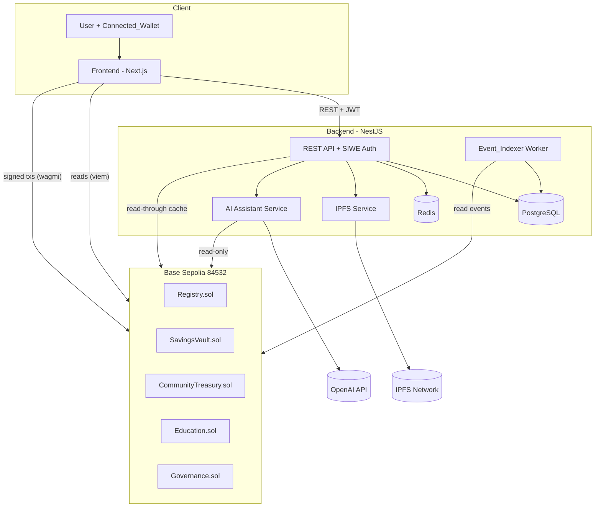
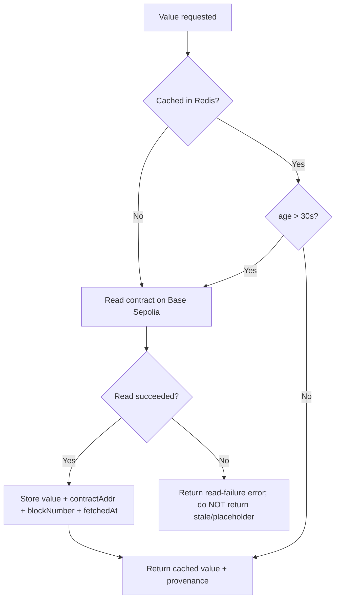
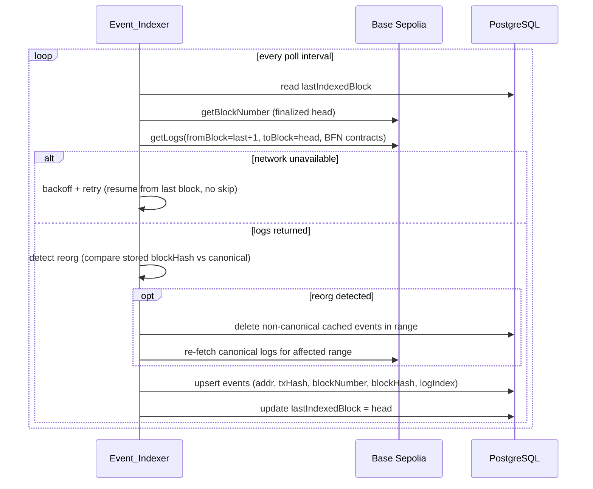
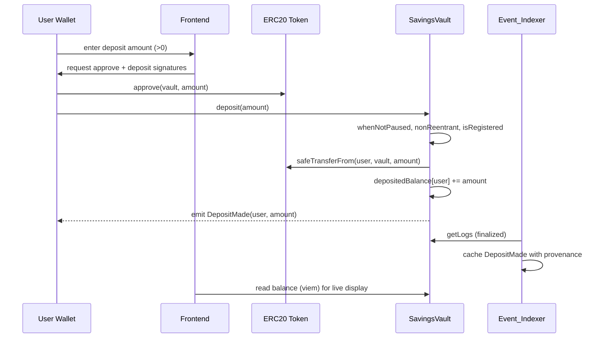
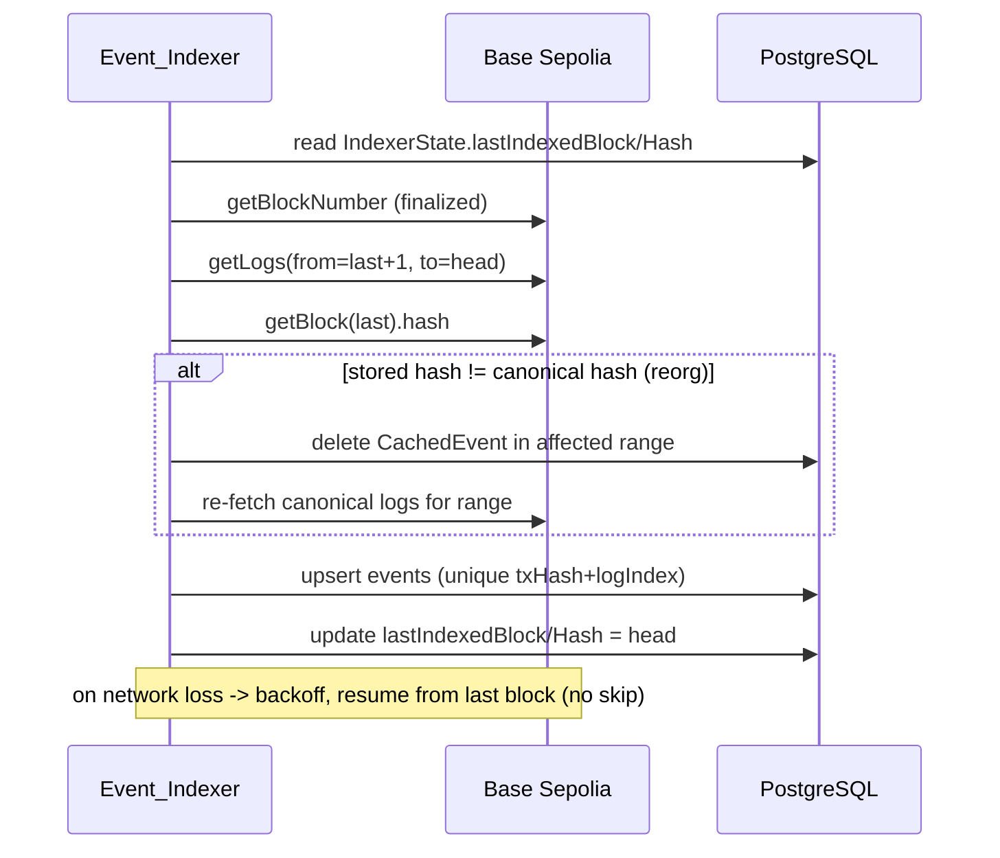
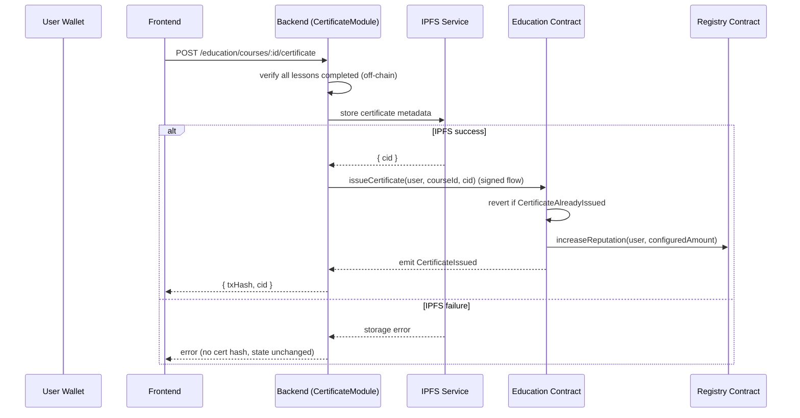

# Design Document: Bonitah Financial Network (BFN)

## Overview

Bonitah Financial Network (BFN) is a production-quality Web3 monorepo in which the blockchain (Base Sepolia, chain ID `84532`) is the single, authoritative source of truth for all financial state. Smart contracts hold every balance, goal, lock, contribution, ownership share, and on-chain proof. The frontend reads financial values directly from deployed contracts, the backend stores only non-financial off-chain data plus a clearly-provenanced cache of blockchain events, and the AI assistant provides guidance without ever signing or initiating transactions.

This design derives every architectural decision from the 19 requirements in `requirements.md`. The core invariants that shape the whole system are:

- **Financial truth lives on-chain** (Req 1, 7, 11): the backend never stores a balance as source of truth; any cached financial value carries its source contract and block number and is stale after 30 seconds.
- **Users sign every state change** (Req 2, 10): all writes are wallet-signed transactions; the backend and contracts reject unsigned writes.
- **Least-privilege access control everywhere** (Req 3, 9, 14): OpenZeppelin `AccessControl` on-chain; JWT + role guards off-chain.
- **Every state change emits an event** (Req 13) so the `Event_Indexer` can build fast, reorg-safe query and analytics caches (Req 12).
- **Failures are surfaced, never masked** (Req 1, 7, 10, 11): reads retry then fail visibly; no substituted or placeholder financial values are ever shown.

### Technology Stack

| Layer | Technology | Rationale (requirement) |
|---|---|---|
| Contracts | Solidity ^0.8.24, Foundry, OpenZeppelin (AccessControl, ReentrancyGuard, Pausable, SafeERC20, UUPS proxies) | Req 3–9, 13, 14 |
| Frontend | Next.js (App Router), TypeScript (strict), TailwindCSS, shadcn/ui, Framer Motion, wagmi, viem, RainbowKit, TanStack Query | Req 1, 2, 11, 19 |
| Backend | NestJS, Prisma, PostgreSQL, Redis, viem (read/index), OpenAI SDK | Req 1, 8, 10, 12, 14 |
| Storage | IPFS (via pinning service, e.g. web3.storage/Pinata) | Req 3, 8 |
| DevOps | Docker, Docker Compose, GitHub Actions, Foundry deploy scripts, Husky, Commitlint | Req 16, 17 |

### Monorepo Structure (Req 17.1)

```
bonitah-financial-network/
├── contracts/        # Foundry project: Registry, SavingsVault, CommunityTreasury, Education, Governance
├── frontend/         # Next.js app (App Router, TS, Tailwind, shadcn/ui, wagmi/viem/RainbowKit)
├── backend/          # NestJS app (REST modules, SIWE auth, Event_Indexer, AI, IPFS)
├── shared/           # Shared TS types, ABIs, contract addresses, zod schemas
├── docs/             # README, API docs, contract docs, deployment & developer guides
├── docker/           # Dockerfiles + docker-compose.yml
├── .github/          # workflows/ (CI: lint, test, build)
├── scripts/          # tooling, codegen, secret-scan, coverage aggregation
├── deployment/       # Base Sepolia deploy scripts + recorded addresses
└── tests/            # cross-cutting/e2e suites
```

The `shared/` package is the contract between layers: after each deployment the ABIs and addresses are emitted here so frontend and backend consume a single typed source.

## Architecture

### System Context



### Key Architectural Principles

1. **Read path duality (Req 1.2, 1.4–1.7, 11):** The frontend reads financial values *directly* from contracts via viem for correctness-critical display. The backend maintains a read-through cache (Redis) for values that benefit from server-side aggregation, always tagged with `{contractAddress, blockNumber, fetchedAt}` and re-read when older than 30s.
2. **Write path (Req 2, 10.5–10.6):** All writes originate as wallet-signed transactions from the frontend directly to contracts. The backend never holds keys and never submits value-moving transactions.
3. **Indexing path (Req 12, 13):** The `Event_Indexer` tails finalized blocks, persists events with full provenance, handles reorgs, and resumes from the last cached block.
4. **Guidance path (Req 10):** The AI assistant reads on-chain figures read-only, calls OpenAI, and returns advice. It surfaces "unavailable" rather than fabricating figures when reads fail.

### Read-Through Cache & Staleness Strategy (Req 1.4, 1.5, 11)



Cache entries use key `bfn:read:{contract}:{fn}:{argsHash}` with a hard TTL of 30s so staleness is enforced by TTL and by explicit `fetchedAt` comparison. On read failure the backend returns an error and never serves a substituted value (Req 1.7, 7.5, 10.9).

### Read Retry / Timeout Policy (Req 1.6, 11.5)

- Frontend contract reads use a per-attempt timeout of 10s and retry up to 3 times (total up to 4 attempts) with exponential backoff before marking a value failed (Req 1.6).
- Dashboard sections use a 30s overall budget; exceeding it transitions the section from loading to error (Req 11.5), which offers a retry action (Req 11.6).
- On terminal failure the affected value renders an explicit error state and no placeholder (Req 1.7, 11.4).

## Components and Interfaces

### Smart Contracts

All contracts share cross-cutting controls (Req 14): OpenZeppelin `AccessControl` for roles, `ReentrancyGuardUpgradeable` on value-transferring functions, `PausableUpgradeable` where deposits/withdrawals occur, `SafeERC20` for token movement, a custom error per revert condition, NatSpec on every public/external function, and exactly one event per state change (Req 13).

Contracts are deployed behind UUPS proxies to satisfy upgradeability (Req 9.8) while preserving state. The shared token is a configurable ERC20 (a test stablecoin on Base Sepolia) set at initialization.

#### Common Roles (Req 14.5, 14.9)

```solidity
bytes32 public constant DEFAULT_ADMIN_ROLE = 0x00;      // OZ default; grants/revokes roles
bytes32 public constant PAUSER_ROLE     = keccak256("PAUSER_ROLE");
bytes32 public constant VERIFIER_ROLE   = keccak256("VERIFIER_ROLE");   // Registry verification
bytes32 public constant UPGRADER_ROLE   = keccak256("UPGRADER_ROLE");   // UUPS _authorizeUpgrade
bytes32 public constant TREASURY_ROLE   = keccak256("TREASURY_ROLE");   // Governance treasury ops
bytes32 public constant REPUTATION_ROLE = keccak256("REPUTATION_ROLE"); // Education -> Registry score updates
```

#### Registry.sol (Req 3, 13.1, 14)

```solidity
interface IRegistry {
    struct UserProfile {
        bool registered;
        bool verified;
        uint256 reputationScore; // non-negative, init 0
        string  ipfsProfileHash;
        uint256 registeredAt;
    }

    event UserRegistered(address indexed user, uint256 timestamp);
    event ProfileUpdated(address indexed user, string ipfsProfileHash);
    event UserVerified(address indexed user, address indexed verifier);
    event ReputationIncreased(address indexed user, uint256 amount, uint256 newScore);

    error AlreadyRegistered(address user);
    error NotRegistered(address user);
    error EmptyProfileHash();
    error UnauthorizedVerifier(address caller);

    function register() external;                                   // Req 3.1
    function updateProfile(string calldata ipfsProfileHash) external; // Req 3.3, 3.4
    function verifyUser(address user) external;                     // Req 3.6, 3.10 (VERIFIER_ROLE)
    function increaseReputation(address user, uint256 amount) external; // Req 8.7 (REPUTATION_ROLE)
    function isRegistered(address user) external view returns (bool);
    function getProfile(address user) external view returns (UserProfile memory);
    function reputationOf(address user) external view returns (uint256);
}
```

Key state: `mapping(address => UserProfile) private _profiles`. `register()` reverts `AlreadyRegistered` if `_profiles[msg.sender].registered` (Req 3.2). `updateProfile` reverts `NotRegistered` for unregistered callers and `EmptyProfileHash` for empty input (Req 3.4). `verifyUser` requires `VERIFIER_ROLE`, else `UnauthorizedVerifier` (Req 3.10). `increaseReputation` is restricted to `REPUTATION_ROLE` (granted to `Education`).

#### SavingsVault.sol (Req 4, 5, 13.2–13.5, 14)

```solidity
interface ISavingsVault {
    struct Goal {
        uint256 id;
        uint256 targetAmount;
        uint256 targetDate;
        uint256 savedAmount;
        bool    completed;
    }
    struct Lock {
        uint256 amount;
        uint256 expiry;
        bool    released;
    }

    event DepositMade(address indexed user, uint256 amount);
    event WithdrawalMade(address indexed user, uint256 amount);
    event GoalCreated(address indexed user, uint256 indexed goalId, uint256 targetAmount, uint256 targetDate);
    event GoalCompleted(address indexed user, uint256 indexed goalId);
    event FundsLocked(address indexed user, uint256 indexed lockId, uint256 amount, uint256 expiry);
    event LockReleased(address indexed user, uint256 indexed lockId, uint256 amount);

    error NotRegisteredUser(address user);
    error ZeroAmount();
    error InsufficientAvailableBalance(uint256 requested, uint256 available);
    error VaultPaused();
    error InvalidGoalParams();
    error InvalidLockDuration(uint256 duration);
    error LockNotExpired(uint256 nowTs, uint256 expiry);

    function deposit(uint256 amount) external;                       // Req 4.2
    function withdraw(uint256 amount) external;                      // Req 4.3, 4.4
    function createGoal(uint256 targetAmount, uint256 targetDate) external; // Req 5.1, 5.7
    function contributeToGoal(uint256 goalId, uint256 amount) external;     // Req 5.2
    function lockFunds(uint256 amount, uint256 duration) external;   // Req 5.3, 5.8
    function withdrawLocked(uint256 lockId) external;                // Req 5.4, 5.5
    function availableBalance(address user) external view returns (uint256); // deposited - locked
    function portfolioValue(address user) external view returns (uint256);   // Req 5.6
}
```

Key state: `depositedBalance[user]`, `lockedTotal[user]`, `Goal[] goals[user]`, `Lock[] locks[user]`. `availableBalance = depositedBalance - lockedTotal`. Constants: `MIN_LOCK = 1 days`, `MAX_LOCK = 5 * 365 days`. All external mutators are `whenNotPaused` + `nonReentrant` and require `registry.isRegistered(msg.sender)` else `NotRegisteredUser` (Req 4.8). Zero amounts revert `ZeroAmount` (Req 4.9). Token moves use `SafeERC20` (Req 4.5).

#### CommunityTreasury.sol (Req 6, 7, 13.6–13.8, 14)

```solidity
interface ICommunityTreasury {
    struct Circle {
        address creator;
        uint256 maxMembers;      // 2..1000
        uint8   approvalThreshold; // 1..100 (percent)
        uint256 memberCount;
        uint256 treasuryBalance;
        bool    open;
    }
    struct Contribution { uint256 amount; uint256 timestamp; }
    struct TreasuryAction {
        uint256 circleId;
        address to;
        uint256 amount;
        uint256 approvals;   // weighted count
        bool    executed;
    }

    event PoolCreated(address indexed creator, uint256 indexed poolId, uint256 maxMembers, uint8 approvalThreshold);
    event MemberJoined(uint256 indexed poolId, address indexed member);
    event ContributionMade(address indexed contributor, uint256 indexed poolId, uint256 amount);
    event VoteCast(address indexed voter, uint256 indexed actionId);
    event ActionExecuted(uint256 indexed actionId, address indexed to, uint256 amount);

    error InvalidCircleParams();
    error NotMember(address caller, uint256 poolId);
    error AlreadyMember(address caller, uint256 poolId);
    error CircleClosedOrFull(uint256 poolId);
    error ZeroAmount();
    error AlreadyVoted(address voter, uint256 actionId);

    function createCircle(uint256 maxMembers, uint8 approvalThreshold) external returns (uint256 poolId); // Req 6.1, 6.11
    function joinCircle(uint256 poolId) external;                    // Req 6.2, 6.9
    function contribute(uint256 poolId, uint256 amount) external;    // Req 6.3, 6.5
    function proposeAction(uint256 poolId, address to, uint256 amount) external returns (uint256 actionId);
    function vote(uint256 actionId) external;                        // Req 6.4, 6.7, 6.10
    // Investment pool interface (Req 7)
    function contributeToPool(uint256 poolId, uint256 amount) external; // Req 7.1, 7.2
    function ownershipShare(uint256 poolId, address member) external view returns (uint256 sharePpm); // ppm
    function yieldDistribution(uint256 poolId, address member, uint256 totalYield) external view returns (uint256); // Req 7.6
    function contributionHistory(uint256 poolId, address member) external view returns (Contribution[] memory); // Req 6.6, 7.3
}
```

Membership/contribution/vote mutators are `nonReentrant` where value moves (Req 6.8). Non-members revert `NotMember` (Req 6.5). Double voting reverts `AlreadyVoted` (Req 6.10). Ownership share is computed as `memberCumulative * 1e6 / poolTotal` (parts-per-million) to preserve precision (Req 7.1). Action executes when weighted approvals `>= ceil(memberCount * threshold / 100)` (Req 6.7).

#### Education.sol (Req 8, 13.9, 14)

```solidity
interface IEducation {
    struct Certificate { uint256 id; bytes32 courseId; string ipfsMetadataHash; uint256 issuedAt; }

    event CertificateIssued(address indexed user, uint256 indexed certificateId, bytes32 indexed courseId);
    event BadgeAwarded(address indexed user, bytes32 indexed badgeId);
    event AchievementRecorded(address indexed user, bytes32 indexed achievementId, uint256 reputationAwarded);

    error CertificateAlreadyIssued(address user, bytes32 courseId);
    error EmptyMetadataHash();
    error UnauthorizedIssuer(address caller);

    function issueCertificate(address user, bytes32 courseId, string calldata ipfsMetadataHash) external; // Req 8.3, 8.4, 8.9, 8.10
    function awardBadge(address user, bytes32 badgeId) external;      // Req 8.5
    function recordAchievement(address user, bytes32 achievementId, uint256 reputationAmount) external; // Req 8.5, 8.7
    function hasCertificate(address user, bytes32 courseId) external view returns (bool);
}
```

`issueCertificate` requires a non-empty metadata hash (Req 8.9 → the backend only calls this after IPFS storage succeeds; empty hash reverts `EmptyMetadataHash`), reverts `CertificateAlreadyIssued` on duplicates (Req 8.10), and calls `Registry.increaseReputation` via `REPUTATION_ROLE` for the configured achievement amount (Req 8.7). Issuance is gated by an `ISSUER_ROLE` (Req 8 flow is orchestrated after off-chain completion checks).

#### Governance.sol (Req 9, 13.8, 14)

```solidity
interface IGovernance {
    enum ProposalState { Active, Passed, Rejected, Executed }
    struct Proposal {
        uint256 id;
        address proposer;
        uint256 votingEnds;
        uint256 forVotes;
        uint256 againstVotes;
        uint256 quorum;
        ProposalState state;
    }

    event ProposalCreated(address indexed proposer, uint256 indexed proposalId, uint256 votingEnds);
    event VoteCast(address indexed voter, uint256 indexed proposalId, uint256 weight, bool support);
    event ProposalFinalized(uint256 indexed proposalId, ProposalState result);

    error NoVotingPower(address caller);
    error ProposalNotActive(uint256 proposalId);
    error AlreadyVoted(address voter, uint256 proposalId);
    error UnauthorizedTreasuryOp(address caller);

    function propose(bytes calldata action, uint256 votingPeriod) external returns (uint256); // Req 9.1
    function castVote(uint256 proposalId, bool support) external;    // Req 9.2, 9.3, 9.9
    function finalize(uint256 proposalId) external;                  // Req 9.4, 9.5
    function outcomeOf(uint256 proposalId) external view returns (ProposalState); // Req 9.6
    function executeTreasury(bytes calldata action) external;        // Req 9.7, 9.10 (TREASURY_ROLE)
    function votingPowerOf(address user) external view returns (uint256);
}
```

Voting power derives from registry reputation/holdings. `castVote` requires `votingPowerOf(msg.sender) > 0` else `NoVotingPower` (Req 9.1), requires `Active` state else `ProposalNotActive` (Req 9.3), and reverts `AlreadyVoted` on repeats (Req 9.9). Treasury ops require `TREASURY_ROLE` else `UnauthorizedTreasuryOp` (Req 9.10). `outcomeOf` computes the result from recorded votes even before `finalize` writes it (Req 9.6). UUPS upgrade preserves proposal/vote storage (Req 9.8).

### Frontend (Next.js)

#### Page Architecture (Req 11.7)

| Route | Page | Data source | Notes |
|---|---|---|---|
| `/` | Landing | static | Framer Motion hero, theme-aware |
| `/auth` | Authentication | wallet + backend nonce/JWT | RainbowKit connect + SIWE |
| `/dashboard` | Dashboard | on-chain reads + indexer | balances, goals, charts, recent txs (≤50) |
| `/savings` | Savings | SavingsVault | deposit/withdraw flows |
| `/goals` | Goals | SavingsVault | create goal, contribute, locks |
| `/community` | Community | CommunityTreasury | circles, contributions, votes |
| `/investments` | Investments | CommunityTreasury | pools, ownership share, yield |
| `/education` | Education | backend + Education | courses, progress, certificates |
| `/assistant` | AI Assistant | backend AI | chat; wallet sign for actions |
| `/profile` | Profile | Registry + IPFS | profile, verification, reputation |
| `/settings` | Settings | local/session | theme, preferences |
| `/admin` | Admin | role-gated | admin-only ops (Req 14.9) |
| `*` | 404 | static | not-found |

#### Component & Data-Fetching Layers

- **Providers:** `WagmiProvider` + `RainbowKitProvider` (configured for Base Sepolia only, Req 2.1/2.3) + `TanStack QueryClient` + `ThemeProvider`.
- **On-chain read hooks:** thin wrappers over `useReadContract`/viem `readContract` with the retry/timeout policy (10s, 3 retries, Req 1.6). Each hook returns `{ data, isLoading, isError, refetch }` so UI can render loading/error/retry states (Req 11.4–11.6).
- **State machine per financial section:** `loading → success | error`; error offers `retry` calling `refetch` (Req 11.6). No placeholder financial values are ever rendered (Req 1.7, 11.4).
- **shadcn/ui + Tailwind** for accessible primitives; **Framer Motion** for transitions.
- **Theming (Req 19):** `ThemeProvider` sets light default on first visit, applies theme across pages without reload within 1s via CSS class on `<html>`, and persists selection for the session.
- **Accessibility (Req 19.6, 19.7):** all interactive elements keyboard-focusable with visible focus ring and programmatic labels (`aria-label`/associated `<label>`).
- **Responsiveness (Req 19.5):** Tailwind breakpoints tuned so no horizontal scroll at 320–767 (mobile), 768–1023 (tablet), ≥1024 (desktop).

#### Authentication Flow Client

`useSiweAuth()` orchestrates: request nonce → build SIWE message (nonce + expiry) → `signMessage` → POST signature → store JWT (httpOnly cookie preferred). Network-guard hook prompts switch to Base Sepolia before any on-chain action (Req 2.3).

### Backend (NestJS)

#### Module Map

| Module | Responsibility | Requirements |
|---|---|---|
| `AuthModule` | SIWE nonce issue, signature verify, JWT issue/validate, roles | 2.4–2.10, 14.1, 14.2 |
| `UsersModule` | off-chain profile metadata, role assignment | 2.10, 3 |
| `EducationModule` | articles/videos/quizzes/courses, progress, streaks, completion | 8.1, 8.2, 8.6, 8.8 |
| `CertificateModule` | orchestrates IPFS store → Education.issueCertificate | 8.3, 8.4, 8.9 |
| `IpfsModule` | upload/pin/retrieve, size & count limits, PII exclusion | 3.5, 3.8, 3.9, 8.4 |
| `IndexerModule` | Event_Indexer worker, reorg handling, resume | 12, 13 |
| `ChainReadModule` | read-through cache with provenance & staleness | 1.4, 1.5, 11 |
| `TransactionsModule` | paged transaction history from cached events | 12.3, 12.4 |
| `AiModule` | OpenAI assistant, on-chain figure reads, history | 10 |
| `AnalyticsModule` | aggregate metrics from cached events | 12 |
| `NotificationsModule` | off-chain notifications | 8, general |
| `HealthModule` | liveness/readiness for compose healthchecks | 16.2 |

#### REST API (representative endpoints; full list in API docs, Req 18.2)

```
POST   /auth/nonce                 -> { nonce }                         public
POST   /auth/verify                -> { jwt, address, role, expiresAt } public   (Req 2.6–2.8)
POST   /auth/logout                                                     auth
GET    /users/me                   -> off-chain profile                 auth
PATCH  /users/me                                                        auth
POST   /ipfs/profile-docs          -> { cid }  (<=10 files, <=10MB ea)  auth     (Req 3.5, 3.9)
GET    /education/courses          -> Course[]                          auth
POST   /education/lessons/:id/complete -> progress/streak              auth      (Req 8.2, 8.8)
POST   /education/courses/:id/certificate -> { txHash, cid }           auth      (Req 8.3, 8.4)
GET    /transactions               -> paged events (<=100)              auth      (Req 12.3, 12.4)
GET    /analytics/portfolio        -> provenanced series               auth      (Req 11.1)
POST   /ai/chat                    -> { answer } (<=2000 chars, 30s)    auth      (Req 10.1, 10.7, 10.8)
GET    /ai/conversations           -> history                          auth      (Req 10.4)
GET    /chain/read/:contract/:fn   -> value + provenance               auth      (Req 1.4, 1.5)
GET    /health                     -> status                           public
```

Every non-public endpoint is protected by `JwtAuthGuard` + `RolesGuard` (Req 14.1, 14.2). All request bodies pass a `ZodValidationPipe`/class-validator schema for presence, type, and bounds; failures return 400 without mutating state (Req 14.3, 14.4).

#### Event_Indexer Worker (Req 12, 13)



- Persists within 60s of finalization (Req 12.1).
- Each event stored with `contractAddress`, `transactionHash`, `blockNumber` provenance and marked derived (Req 12.2).
- Idempotent upsert keyed on `(transactionHash, logIndex)` prevents duplicates on retry.
- Reorg handling deletes non-canonical events and re-caches canonical ones (Req 12.5).
- Resume-from-last-block with no gaps on reconnect (Req 12.6).

#### AI Assistant Service (Req 10)

- Validates question length ≤ 2000 chars, else 400 with max-length error (Req 10.7).
- Reads on-chain figures read-only via `ChainReadModule`; on read failure marks figures unavailable, never fabricates (Req 10.3, 10.9).
- Calls OpenAI with a system prompt scoped to budgeting/savings/investment education/goals/tx explanation/portfolio insight and an explicit "never sign or initiate transactions" instruction (Req 10.1, 10.2).
- Enforces a 30s timeout; on timeout/unavailability returns "temporarily unavailable" and retains history (Req 10.8).
- Persists conversation history as off-chain data (Req 10.4).
- The service returns advice only; any recommended action is executed by the user signing in the frontend (Req 10.5).

#### IPFS Service (Req 3.5, 3.8, 3.9, 8.4)

- Accepts ≤10 documents/request, ≤10MB each; rejects over-limit uploads (Req 3.5).
- Strips/validates against PII fields (gov IDs, address, phone, email, financial credentials) before pinning publicly-readable content (Req 3.8).
- Returns CID on success; on failure returns storage error and no CID (Req 3.9, 8.9).

## Data Models

### On-Chain State (source of truth)

Financial state lives entirely in contract storage described above (`UserProfile`, `Goal`, `Lock`, `Circle`, `Contribution`, `TreasuryAction`, `Proposal`, `Certificate`). The off-chain database never stores these as authoritative values.

### Prisma Schema (Off-Chain + Cached Events)

```prisma
// datasource + generator omitted for brevity

enum Role {
  USER
  VERIFIER
  ADMIN
}

model User {
  id            String   @id @default(cuid())
  walletAddress String   @unique          // lowercased checksum key
  role          Role     @default(USER)   // Req 2.10 least-privilege default
  displayName   String?
  createdAt     DateTime @default(now())
  conversations Conversation[]
  progress      LessonProgress[]
  notifications Notification[]
  @@index([walletAddress])
}

model AuthNonce {
  id        String   @id @default(cuid())
  nonce     String   @unique
  address   String
  used      Boolean  @default(false)      // single-use (Req 2.7)
  expiresAt DateTime                       // expiry (Req 2.4, 2.6)
  createdAt DateTime @default(now())
  @@index([address])
}

// Off-chain educational content (Req 8.1, 8.6)
model Course {
  id        String   @id @default(cuid())
  title     String
  onChainId String   @unique              // bytes32 courseId reference
  lessons   Lesson[]
}

model Lesson {
  id       String @id @default(cuid())
  courseId String
  course   Course @relation(fields: [courseId], references: [id])
  title    String
  order    Int
  contentType String                       // article | video | quiz
  contentUrl  String
  progress LessonProgress[]
  @@index([courseId])
}

model LessonProgress {
  id          String   @id @default(cuid())
  userId      String
  lessonId    String
  user        User     @relation(fields: [userId], references: [id])
  lesson      Lesson   @relation(fields: [lessonId], references: [id])
  completedAt DateTime @default(now())
  @@unique([userId, lessonId])            // dedupe completion (Req 8.8)
}

model LearningStreak {
  id            String   @id @default(cuid())
  userId        String   @unique
  currentStreak Int      @default(0)      // consecutive days (Req 8.2)
  lastActiveDay DateTime
}

// Cached blockchain events — DERIVED data with provenance (Req 12.2, 1.4)
model CachedEvent {
  id              String   @id @default(cuid())
  contractAddress String                   // provenance (Req 12.2)
  eventName       String
  walletAddress   String?                  // subject for tx history (Req 12.3)
  transactionHash String                   // provenance
  blockNumber     BigInt                   // provenance + ordering
  blockHash       String                   // reorg detection (Req 12.5)
  logIndex        Int
  payload         Json                     // decoded args
  createdAt       DateTime @default(now())
  @@unique([transactionHash, logIndex])    // idempotent indexing (Req 12.6)
  @@index([walletAddress, blockNumber])    // paged desc history (Req 12.3)
  @@index([contractAddress, blockNumber])
}

model IndexerState {
  id               String @id @default("singleton")
  lastIndexedBlock BigInt                   // resume point (Req 12.6)
  lastIndexedHash  String
  updatedAt        DateTime @updatedAt
}

// Read-through cached financial values with provenance (Req 1.4)
model CachedReadValue {
  id              String   @id @default(cuid())
  cacheKey        String   @unique
  contractAddress String                   // source contract (Req 1.4)
  blockNumber     BigInt                   // derived-from block (Req 1.4)
  value           String                   // stringified numeric
  fetchedAt       DateTime                  // staleness anchor (Req 1.4, 1.5 = 30s)
  @@index([cacheKey])
}

model Conversation {
  id        String   @id @default(cuid())
  userId    String
  user      User     @relation(fields: [userId], references: [id])
  createdAt DateTime @default(now())
  messages  Message[]
}

model Message {
  id             String   @id @default(cuid())
  conversationId String
  conversation   Conversation @relation(fields: [conversationId], references: [id])
  role           String                     // user | assistant
  content        String
  createdAt      DateTime @default(now())
  @@index([conversationId])
}

model Notification {
  id        String   @id @default(cuid())
  userId    String
  user      User     @relation(fields: [userId], references: [id])
  type      String
  message   String
  read      Boolean  @default(false)
  createdAt DateTime @default(now())
}
```

Redis holds ephemeral read-through cache entries (30s TTL) mirroring `CachedReadValue` semantics for hot paths, plus rate-limit counters and session/nonce fast lookups.

### Shared Types (`shared/`)

Generated TS types from Prisma and from contract ABIs (via viem/`abitype`), plus canonical deployed addresses per network, consumed by both frontend and backend to guarantee a single typed contract surface.

## Correctness Properties

*A property is a characteristic or behavior that should hold true across all valid executions of a system—essentially, a formal statement about what the system should do. Properties serve as the bridge between human-readable specifications and machine-verifiable correctness guarantees.*

The following properties were derived from the prework analysis and consolidated to remove redundancy. Each is universally quantified and will be implemented as a single property-based test (minimum 100 iterations) tagged with its feature and property number. Criteria classified as EXAMPLE, EDGE_CASE, INTEGRATION, or SMOKE are covered by the Testing Strategy rather than by these properties.

### Property 1: Cached financial values carry provenance and honor 30s staleness

*For any* cached financial value or cached blockchain event, the entry always records its source contract address and block number, and a cached read value is treated as stale if and only if its age exceeds 30 seconds.

**Validates: Requirements 1.4, 12.2**

### Property 2: Stale reads are refreshed from the source contract

*For any* read request, if the cached value is absent or stale (age > 30s) the system reads from the source contract before returning, and if fresh it returns the cached value without re-reading.

**Validates: Requirements 1.5**

### Property 3: Read retry policy is bounded and correct

*For any* sequence of read attempt outcomes, the frontend makes at most 4 attempts (initial + 3 retries) with a 10s per-attempt timeout, returns success if any attempt within budget succeeds, and otherwise yields a terminal failure.

**Validates: Requirements 1.6**

### Property 4: SIWE nonces are single-use and expiry-bounded

*For any* issued nonce, a first valid verification succeeds and invalidates the nonce, and any subsequent verification with the same nonce, or verification of an expired nonce, is rejected without establishing a session.

**Validates: Requirements 2.4, 2.6, 2.7, 2.8**

### Property 5: Sessions are accepted iff the JWT is valid and unexpired

*For any* request to a non-public endpoint, the backend accepts it if and only if it carries a valid, unexpired JWT whose expiry is at most 24 hours after issuance; otherwise it is rejected with an authentication error and no state change.

**Validates: Requirements 2.7, 2.9, 14.1, 14.2**

### Property 6: New wallets default to least-privilege role

*For any* newly authenticated wallet with no prior role assignment, the assigned role is the non-administrative default (USER).

**Validates: Requirements 2.10**

### Property 7: Registration initializes state and is not repeatable

*For any* wallet, registering an unregistered wallet marks it registered with reputation zero, while registering an already-registered wallet reverts and leaves its record unchanged.

**Validates: Requirements 3.1, 3.2**

### Property 8: Profile update round-trip for registered users only

*For any* registered user and non-empty IPFS hash, updating the profile stores exactly that hash, while an update from an unregistered wallet or with an empty hash reverts and stores nothing.

**Validates: Requirements 3.3, 3.4**

### Property 9: Reputation is a monotonic non-negative integer

*For any* sequence of reputation-affecting operations, a user's reputation score remains a non-negative integer, starts at zero, and increases by exactly the configured amount for each earned achievement.

**Validates: Requirements 3.7, 8.7**

### Property 10: IPFS upload boundary validation

*For any* set of uploaded profile documents, the upload is accepted if and only if it contains at most 10 documents each at most 10 MB, and accepted publicly-readable content never contains the excluded PII fields (government IDs, residential address, phone, email, financial credentials).

**Validates: Requirements 3.5, 3.8**

### Property 11: Vault balance conservation and portfolio value

*For any* registered user and valid deposit or withdrawal (amount in (0, available]), the deposited balance changes by exactly that amount, and at all times `availableBalance == depositedBalance - lockedTotal` and `portfolioValue == deposited + goalSavings + locked`.

**Validates: Requirements 4.2, 4.3, 5.6**

### Property 12: Invalid vault operations revert without state change

*For any* deposit or withdrawal that is zero-amount, exceeds available balance, comes from an unregistered wallet, or occurs while paused, the contract reverts with the corresponding custom error and leaves balances unchanged.

**Validates: Requirements 4.4, 4.7, 4.8, 4.9**

### Property 13: Goal lifecycle correctness

*For any* goal created with target > 0 and target date in the future, the goal is recorded with those exact parameters, and the goal is marked completed if and only if cumulative goal savings reach or exceed its target; invalid goal parameters revert and record nothing.

**Validates: Requirements 5.1, 5.2, 5.7**

### Property 14: Locked savings time-lock round-trip

*For any* lock with duration in [1 day, 5 years] and amount ≤ available balance, the lock is recorded with expiry = creation time + duration; withdrawal before expiry reverts and retains the lock, while withdrawal at or after expiry releases exactly the locked amount back to available balance. Locks with out-of-range duration or amount exceeding available balance revert and lock nothing.

**Validates: Requirements 5.3, 5.4, 5.5, 5.8**

### Property 15: Savings circle creation and membership rules

*For any* circle created with maxMembers in [2, 1000] and threshold in [1, 100], the circle stores those parameters with the creator as a member; a non-member may join an open, non-full circle (incrementing member count), while joining a closed, full, or already-joined circle reverts and adds no member. Out-of-range creation parameters revert and create no circle.

**Validates: Requirements 6.1, 6.2, 6.9, 6.11**

### Property 16: Circle contributions and per-member history

*For any* member and contribution amount > 0, the circle treasury increases by exactly that amount and the member's contribution history is extended with the amount and its block timestamp in order; non-member contributions revert with no treasury change.

**Validates: Requirements 6.3, 6.6, 6.5**

### Property 17: Treasury action executes exactly at threshold

*For any* treasury action and sequence of member votes, the action executes if and only if cumulative approving votes reach or exceed the circle's stored approval threshold.

**Validates: Requirements 6.7**

### Property 18: Repeated operations are rejected while prior state is retained

*For any* operation that must not repeat (duplicate registration, duplicate circle vote, duplicate governance vote, duplicate lesson completion, duplicate course certificate), a repeat invocation is rejected with the corresponding custom error and the previously recorded state is retained unchanged.

**Validates: Requirements 3.2, 6.10, 8.8, 8.10, 9.9**

### Property 19: Investment pool ownership share and yield are proportional and conserved

*For any* sequence of pool contributions, each member's ownership share equals that member's cumulative contribution divided by the pool total, the sum of all shares equals the whole (within rounding), and for any total yield each member's distribution is proportional to their share with the sum of distributions not exceeding the total.

**Validates: Requirements 7.1, 7.6**

### Property 20: Pool contribution records amount and timestamp

*For any* accepted pool contribution, the member's contribution history gains a record containing the exact amount and the block timestamp at which it was recorded.

**Validates: Requirements 7.3**

### Property 21: Learning streak equals consecutive-day count

*For any* sequence of lesson completions across calendar days, the recorded learning streak equals the number of consecutive calendar days (ending on the most recent activity) on which at least one lesson was completed.

**Validates: Requirements 8.2**

### Property 22: Certificate and achievement proofs recorded once

*For any* course whose every lesson is completed, exactly one certificate proof is issued on-chain and reputation increases by the configured amount; badges and achievements are recorded as on-chain proofs.

**Validates: Requirements 8.3, 8.5**

### Property 23: Governance proposal and weighted voting correctness

*For any* eligible proposer (voting power > 0), a created proposal is Active with a voting-end timestamp; any vote on an Active proposal is recorded weighted by the voter's voting power, while a vote on a non-active proposal reverts.

**Validates: Requirements 9.1, 9.2, 9.3**

### Property 24: Proposal outcome is determined by recorded votes

*For any* set of recorded votes at the end of the voting period, the proposal is marked passed if and only if it meets both quorum and approval threshold (otherwise rejected), and `outcomeOf` computed from recorded votes agrees with the finalized state.

**Validates: Requirements 9.4, 9.5, 9.6**

### Property 25: Upgrade preserves governance state

*For any* recorded set of proposals and votes, upgrading the governance implementation preserves all proposal and voting state (a round-trip identity across the upgrade).

**Validates: Requirements 9.8**

### Property 26: Unauthorized privileged operations revert without state change

*For any* privileged contract operation invoked by a caller lacking the required role (verifier, treasury, admin-scoped, or any AccessControl-gated function), the call reverts with a custom error and leaves contract state unchanged.

**Validates: Requirements 3.10, 6.5, 9.7, 9.10, 14.5, 14.7, 14.9**

### Property 27: Unsigned transactions are rejected

*For any* transaction reaching the backend or a BFN contract without a valid Connected_Wallet signature, it is rejected and produces no state change.

**Validates: Requirements 10.6**

### Property 28: AI assistant never signs or submits transactions

*For any* prompt to the AI assistant, its response never initiates, signs, or submits a blockchain transaction (no signing/broadcast API is invoked).

**Validates: Requirements 10.2**

### Property 29: AI question length boundary

*For any* submitted question, the assistant processes it if and only if it is at most 2,000 characters; longer questions are rejected with a maximum-length error and no response is generated.

**Validates: Requirements 10.7**

### Property 30: Transaction history is scoped, ordered, and paged

*For any* set of cached events and an authenticated request, the returned transaction history contains only events for the requesting wallet, is ordered by descending block number, and contains at most 100 events per page (and at most 50 for the dashboard recent-transactions view, most-recent-first).

**Validates: Requirements 11.2, 12.3**

### Property 31: Event indexing converges to canonical chain state

*For any* sequence of block additions and reorganizations, after processing the indexer's cached events for the affected range equal exactly the canonical Base_Sepolia events for that range (non-canonical events removed, canonical events present, no duplicates).

**Validates: Requirements 12.5**

### Property 32: Indexing resumes gaplessly

*For any* sequence of indexing interruptions and resumptions, the set of indexed block numbers forms a contiguous range with no skipped blocks, resuming from the last successfully cached block.

**Validates: Requirements 12.6**

### Property 33: Exactly one event per successful state change; none on revert

*For any* successful state-changing contract call, exactly one corresponding event is emitted in the same transaction with the specified argument values; *for any* reverting call, no state-change event is emitted.

**Validates: Requirements 13.1, 13.2, 13.3, 13.4, 13.5, 13.6, 13.7, 13.8, 13.9, 13.10**

### Property 34: Input schema validation rejects invalid input without mutation

*For any* request input, the backend accepts it if and only if it satisfies the defined schema (required fields present, correct types, values within bounds); invalid input is rejected with a validation error and persisted state is left unchanged.

**Validates: Requirements 14.3, 14.4**

## Key Flow Sequence Diagrams

### SIWE Sign-In (Req 2.4–2.10)

```mermaid
sequenceDiagram
    participant U as User Wallet
    participant FE as Frontend
    participant BE as Backend (AuthModule)
    participant DB as PostgreSQL

    U->>FE: Connect wallet (RainbowKit, Base Sepolia)
    FE->>BE: POST /auth/nonce
    BE->>DB: store AuthNonce{nonce, address, expiresAt, used=false}
    BE-->>FE: { nonce }
    FE->>FE: build SIWE message (nonce + expiry)
    FE->>U: request signature
    U-->>FE: signature (or decline -> cancel, no session)
    FE->>BE: POST /auth/verify { message, signature }
    BE->>BE: recover signer; verify address match
    BE->>DB: check nonce unused & unexpired
    alt valid
        BE->>DB: mark nonce used
        BE-->>FE: { jwt (<=24h), address, role }
    else invalid/expired/reused
        BE-->>FE: 401 authentication error (no session)
    end
```

### Deposit (Req 4.2, 4.5, 4.6, 13.2)



### Event Indexing with Reorg Handling (Req 12.1, 12.5, 12.6)



### Certificate Issuance (Req 8.3, 8.4, 8.9)



## Error Handling

### Smart Contracts (Req 14.8, 13.10)

- Every revert path uses a dedicated custom error (no bare `require` strings), reverting atomically so no partial state or event is emitted (Req 13.10).
- `ReentrancyGuard` on all value-transferring functions (Req 14.6); `Pausable` gates deposits/withdrawals (Req 4.7); `SafeERC20` surfaces transfer failures as reverts (Req 4.5).
- Access-control failures revert with `Unauthorized*` errors, leaving state unchanged (Req 14.7).

### Frontend (Req 1.6, 1.7, 11.4–11.6, 2.2, 2.3)

- Read hooks implement the 10s-timeout / 3-retry policy; terminal failures render an explicit per-section error state with a retry action and never a placeholder financial value.
- Wallet errors (rejected connection, wrong network) show actionable states: connection-not-completed and switch-to-Base-Sepolia prompts.
- A global error boundary catches render failures; the 404 page handles unknown routes.
- Transaction errors (user rejection, revert, insufficient gas) are decoded from contract custom errors and shown with human-readable messages.

### Backend (Req 2.8, 10.7, 10.8, 10.9, 14.2, 14.4)

- A global `HttpExceptionFilter` maps errors to consistent JSON `{ statusCode, error, message }`.
- Auth failures → 401; validation failures → 400 (state unchanged); AI timeout/unavailable → 503 with history retained; on-chain read failure surfaced as "unavailable" (never fabricated).
- The `ChainReadModule` distinguishes timeout vs RPC error vs decode error and never returns stale data on failure.
- The `Event_Indexer` treats network loss as retryable with exponential backoff and gapless resume; poison events are logged and skipped only after bounded retries without advancing the resume pointer past unprocessed blocks.

### Logging & Observability

- Structured JSON logging (nestjs-pino) with request IDs; wallet addresses logged, secrets/PII never logged.
- Indexer emits metrics: lag (head − lastIndexedBlock), reorg count, retry count.
- Health endpoints expose DB/Redis/RPC connectivity for Docker Compose healthchecks (Req 16.2).

## Testing Strategy

BFN uses a dual approach: **property-based tests** for the universal properties above and **unit/integration/e2e tests** for examples, edge cases, integration, and smoke items identified in the prework.

### Property-Based Testing

- **Contracts:** Foundry fuzz/invariant testing (`forge test` with `foundry.toml` `fuzz.runs >= 100` and invariant runs) implements Properties 7–9, 11–20, 22–26, 33 against the Solidity logic.
- **Backend/Frontend:** `fast-check` (with Jest/Vitest) implements Properties 1–6, 10, 18, 21, 27–34 over pure logic (cache staleness, retry policy, nonce/JWT logic, streak computation, indexer reorg/resume simulation, pagination/ordering, validation).
- Each property test runs a minimum of 100 iterations and is tagged:
  `// Feature: bonitah-financial-network, Property {n}: {property text}`
- Each property test references its design property number for traceability.

### Unit & Integration & Smoke Tests (non-PBT criteria)

- **Contracts (Req 15.1–15.3):** ≥1 unit test per public/external function, ≥90% line & branch coverage; event-emission assertions for every state-change event with expected args; a revert-condition test per custom error; dedicated reentrancy-attack tests (Req 4.6, 6.8, 14.6).
- **Backend (Req 15.4):** unit + integration tests for every endpoint and worker, ≥80% line coverage; SIWE flow, IPFS store/failure, AI scoping/timeout, indexer timing (Req 12.1) as integration tests with 1–3 examples.
- **Frontend (Req 15.5):** component tests ≥80% line coverage; e2e (Playwright) for account creation, authentication, initiating a transaction, and viewing transaction history; loading/error/retry state tests; theming (Req 19.1–19.4), responsiveness at 320/768/1024 (Req 19.5), and accessibility via axe + keyboard traversal (Req 19.6, 19.7).
- **Smoke:** chainId == 84532 (Req 1.1), no mock/hardcoded financial values via static scan (Req 1.8, 17.5), custom-error + NatSpec presence (Req 14.8), repo structure (Req 17.1), lint/tsc-strict (Req 17.2–17.4), secret scan (Req 16.8).

### Test Reporting (Req 15.6–15.8)

- Standard reporters emit per-test pass/fail plus totals (passed/failed/skipped); any failure yields an overall failure with failing test names; configuration/dependency errors report the cause and an overall failure (never zero-passed-as-success). CI aggregates coverage across packages.

## DevOps & Deployment (Req 16)

- **Docker:** multi-stage Dockerfiles for frontend and backend producing runnable images (Req 16.1).
- **Docker Compose:** `docker/docker-compose.yml` starts frontend, backend, PostgreSQL, Redis with healthchecks reaching healthy within 120s (Req 16.2).
- **GitHub Actions:** `.github/workflows/ci.yml` runs lint → test → build within 30 minutes; any failing step fails the run, reports the failing step, and blocks deployment (Req 16.3, 16.4).
- **Deployment scripts:** Foundry scripts in `deployment/` deploy all five contracts to Base Sepolia, record addresses to `shared/`, and report them on success; a failed deployment exits non-zero, names the failed contract, and reports no partial success (Req 16.5, 16.6).
- **Config & secrets:** all environment-specific config via env vars; secrets excluded from VCS; Husky pre-commit secret scan blocks commits containing secrets (Req 16.7, 16.8, 17.6, 17.7).

## Documentation (Req 18)

- **README:** platform description, ordered local setup steps, description of every top-level directory (Req 18.1).
- **API docs:** every REST endpoint with method, path, params/body, response body, auth requirement, and documented error conditions/responses (Req 18.2, 18.3).
- **Contract docs:** every deployed contract with all public/external functions, emitted events, and roles — generated from NatSpec (Req 18.4).
- **Deployment guide:** prerequisites and ordered steps for Base Sepolia contract deployment and service deployment (Req 18.5).
- **Environment/developer guide:** required tools with minimum versions, required env vars, ordered build/start commands per service (Req 18.6).

## Requirements Coverage Summary

- Req 1 (source of truth): Architecture read paths, cache staleness, retry policy; Properties 1–3.
- Req 2 (auth): SIWE flow; Properties 4–6.
- Req 3 (registry/profile/IPFS): Registry.sol, IPFS Service; Properties 7–10, 26.
- Req 4–5 (vault/goals/locks): SavingsVault.sol; Properties 11–14.
- Req 6 (circles): CommunityTreasury.sol; Properties 15–18.
- Req 7 (investment pools): CommunityTreasury.sol; Properties 19–20.
- Req 8 (education): Education.sol + backend; Properties 9, 18, 21–22.
- Req 9 (governance): Governance.sol; Properties 18, 23–26.
- Req 10 (AI): AiModule; Properties 27–29.
- Req 11 (dashboard): Frontend; Properties 2–3, 30 + component/e2e tests.
- Req 12 (indexing): Event_Indexer; Properties 1, 30–32.
- Req 13 (events): all contracts; Property 33.
- Req 14 (security): cross-cutting; Properties 5, 18, 26–27, 34.
- Req 15 (testing): Testing Strategy.
- Req 16 (devops): DevOps & Deployment.
- Req 17 (repo/quality): Monorepo Structure + smoke tests.
- Req 18 (docs): Documentation.
- Req 19 (a11y/theming/responsive): Frontend + component/e2e/a11y tests.
